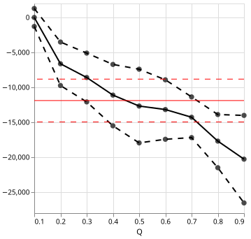
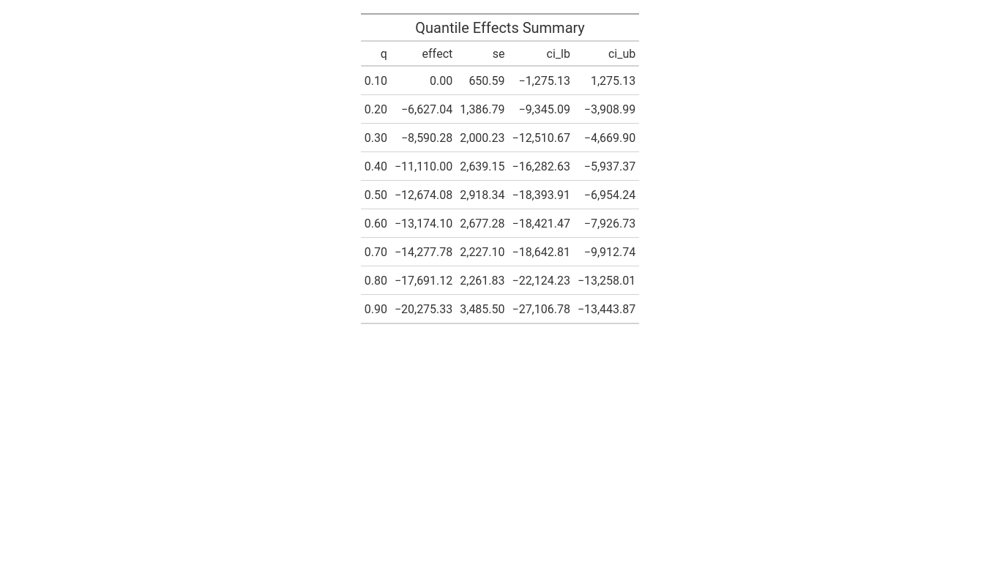

# qte — Quantile Treatment Effects in Python 

This is an attempt at a Python implementation of the qte R package by Brantly Callaway from [here](https://github.com/bcallaway11/qte). 

The main **features** are:
  - Availability of **cross-sectional quantile treatment effects** and quantile treatment effects  on the treated estimators (simple ,IPW, outcome regression, doubly robust);
- **Fast**: 
  - as opposed to the R-package we can use highly optimized Numpy functions for computing weighted quantiles; 
  - quantile regression is magnitudes faster than in other Python packages since we use highly optimized Fortran code directly; 
  - parallelism for bootstrapped standard errors;
  - batching and vectorization in performance critical places;
  - built natively on [Polars](https://github.com/pola-rs/polars);
- **Beautiful**: Graphs and tables for the console, the web, and latex powered by [Altair](https://github.com/vega/altair), [Great Tables](https://github.com/posit-dev/great-tables) and [Rich](https://github.com/textualize/rich).

---

# Installation

---

# Example

 ```python
   from qte.cross_sectional import estimate_aipw_qte
   from qte.datasets import load_lalonde

   ds = load_lalonde()

   res = estimate_aipw_qte(
       ds=ds,
       outcome_c="re78",
       treatment_c="treat",
       or_x_formular="age + education",
       ps_x_formular="age + education",
   )

   print(res)  # Rich table (not shown good for console) 
   res.plot()  # Vega-Altair plot (see below)
   res.tabulate() # Great Tables output (see below)
 ```

### QTE Results Plot


### QTE Results Table


---

# Development
