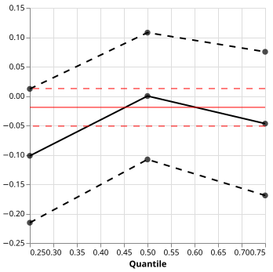
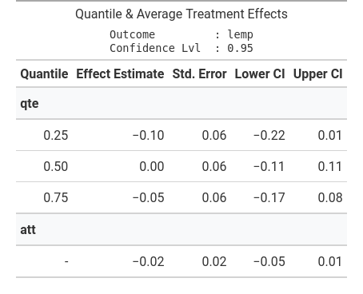

# qte — Quantile Treatment Effects in Python

> **Alpha software:** the API may change without notice between releases.

This is an attempt at a Python implementation of the qte R package by Brantly Callaway from [here](https://github.com/bcallaway11/qte).

The main **features** are:

- Availability of **cross-sectional quantile treatment effects** estimators (simple, inverse probability weighted, outcome regression, doubly robust) and **non-linear difference-in-differences** estimator (changes-in-changes and quantile difference-in-differences);
- **Fast**:
  - as opposed to the R-package we can use highly optimized Numpy functions for computing weighted quantiles;
  - quantile regression is magnitudes faster than in other Python packages since we use highly optimized Fortran code directly (falling back to statsmodels where the extension is unavailable);
  - parallelism for bootstrapped standard errors;
  - batching and vectorization in performance critical places;
  - built natively on [Polars](https://github.com/pola-rs/polars);
- **Beautiful**: Graphs and tables for the console, the web, and latex powered by [Altair](https://github.com/vega/altair), [Great Tables](https://github.com/posit-dev/great-tables) and [Rich](https://github.com/textualize/rich).

---

# Installation

Requires Python 3.12 or newer.

```bash
uv add py-qte
# or
pip install py-qte
```

Prebuilt wheels ship for Linux (x86_64) and macOS (Intel and Apple Silicon).
On those platforms quantile regression uses the bundled Fortran Frisch-Newton
solver. Everywhere else — including Windows — a pure-Python wheel falls back to
[statsmodels](https://www.statsmodels.org/) for quantile regression: same
results to roughly `1e-5`, but slower.

Building from source additionally needs a Fortran compiler (`gfortran`) and
BLAS/LAPACK development libraries. When they are missing, the build
automatically skips the extension and installs the pure-Python fallback.

---

# Examples

## Cross-Sectional Data

We can estimate quantile treatment (and average) treatment effects using an
augmented inverse propensity score (AIPW) estimator .


```python
from qte.cross_sectional import estimate_aipw_qte
from qte.datasets import load_lalonde

ds = load_lalonde()

res = estimate_aipw_qte(
    ds=ds,
    outcome_c="re78",
    treatment_c="treat",
    or_x_formular="age + education",
    ps_x_formular="age + education",
)

print(res)  # Rich table (not shown good for console)
res.plot()  # Vega-Altair plot (see below)
res.tabulate()  # Great Tables output (see below)
```

<table width="100%" border="0" cellpadding="0" cellspacing="0">
  <tr>
    <td width="48%" valign="top" align="center">
      
    </td>
    <td width="4%"></td>
    <td width="48%" valign="top" align="center">
      
    </td>
  </tr>
</table>

## Non-Linear Difference-in-Differences

We can estimate quantile treatment (and average) treatment effects with the changes-in-changes estimator.

```python
import polars as pl

from qte.non_linear_did.changes_in_changes import (
    estimate_changes_in_changes_for_panel,
    CounterfactualModel,
)
from qte.datasets import load_mpdta

ds = load_mpdta().with_columns(
    pl.col("first.treat").replace(0, float("inf")).alias("first.treat"),
    pl.col("year").cast(pl.Float64).alias("year"),
)
res = estimate_changes_in_changes_for_panel(
    ds,
    "lemp",
    "first.treat",
    "year",
    "countyreal",
    qs=[0.25, 0.5, 0.75],
    counterfactual_model=CounterfactualModel.CIC,
)
```

<table width="100%" border="0" cellpadding="0" cellspacing="0">
  <tr>
    <td width="48%" valign="top" align="center">
      
    </td>
    <td width="4%"></td>
    <td width="48%" valign="top" align="center">
      
    </td>
  </tr>
</table>

---

# Development

Regenerate the figures above after changing the estimators or their presentation:

```sh
uv run python -m docs.readme
```
