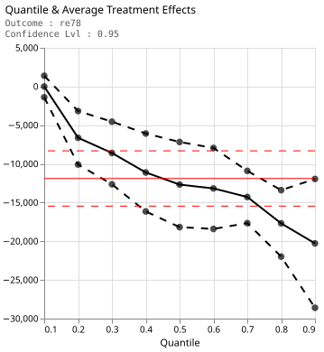
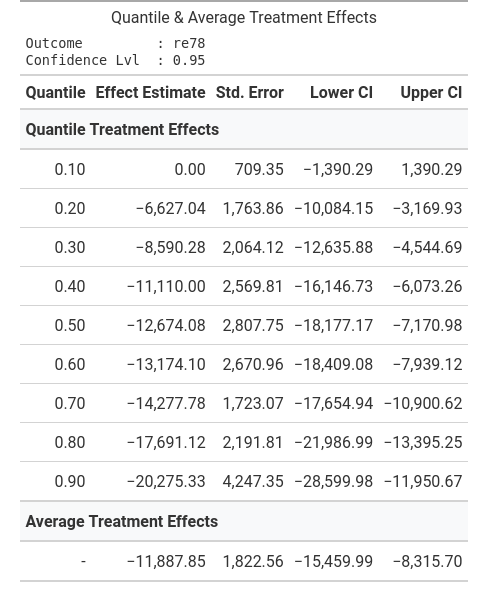
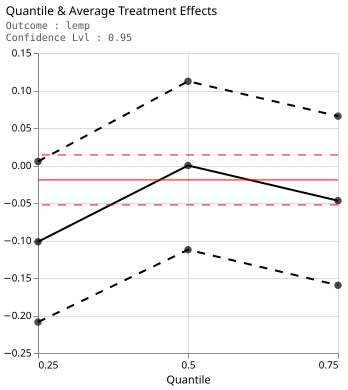
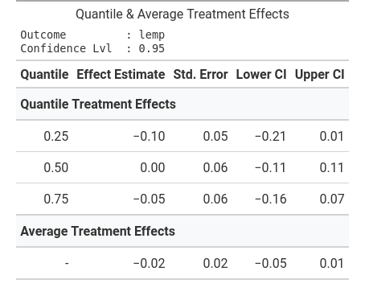

# qte — Quantile Treatment Effects in Python

> **Alpha software:** the API may change without notice between releases.

This is an attempt at a Python implementation of the qte R package by Brantly Callaway from [here](https://github.com/bcallaway11/qte).

The main **features** are:

- Availability of **cross-sectional quantile treatment effects** estimators (simple, inverse probability weighted, outcome regression, doubly robust) and **non-linear difference-in-differences** estimator (changes-in-changes and quantile difference-in-differences);
- **Fast**:
  - as opposed to the R-package we can use highly optimized Numpy functions for computing weighted quantiles;
  - quantile regression is magnitudes faster than in other Python packages since we use highly optimized Fortran code directly (falling back to statsmodels where the extension is unavailable);
  - batching and vectorization in performance critical places;
  - built natively on [Polars](https://github.com/pola-rs/polars);
- **Beautiful**: Graphs and tables for the console, the web, and latex powered by [Altair](https://github.com/vega/altair), [Great Tables](https://github.com/posit-dev/great-tables) and [Rich](https://github.com/textualize/rich).

---

# Installation

Requires Python 3.12 or newer.

```bash
uv add py-qte # or pip install py-qte
```

On Linux and macOS the Fortran solver for quantile regression should work and
be used. On Windows a fallback (based on the `statsmodels` library will be
used).

---

# Examples

## Cross-Sectional Data

We can estimate quantile treatment (and average) treatment effects using an
augmented inverse propensity score (AIPW) estimator .


```python
from qte.cross_sectional import estimate_aipw_qte
from qte.datasets import load_lalonde

ds = load_lalonde()

res = estimate_aipw_qte(
    ds=ds,
    outcome_c="re78",
    treatment_c="treat",
    or_x_formular="age + education",
    ps_x_formular="age + education",
)

res.plot()  # Vega-Altair plot (see below)
res.tabulate()  # Great Tables output (see below)
```

<table width="100%" border="0" cellpadding="0" cellspacing="0">
  <tr>
    <td width="48%" valign="top" align="center">
      
    </td>
    <td width="4%"></td>
    <td width="48%" valign="top" align="center">
      
    </td>
  </tr>
</table>

## Non-Linear Difference-in-Differences

We can estimate quantile treatment (and average) treatment effects with the changes-in-changes estimator.

```python
from qte.nonlinear_did import (
    CounterfactualModel,
    TrtGroupConfig,
    estimate_nonlinear_did_for_panel,
)
from qte.datasets import load_mpdta

ds = load_mpdta()
res = estimate_nonlinear_did_for_panel(
    ds,
    "lemp",
    TrtGroupConfig("first.treat", 0),  # never-treated group is 0
    "year",
    "countyreal",
    qs=[0.25, 0.5, 0.75],
    counterfactual_model=CounterfactualModel.CIC,
)
```

<table width="100%" border="0" cellpadding="0" cellspacing="0">
  <tr>
    <td width="48%" valign="top" align="center">
      
    </td>
    <td width="4%"></td>
    <td width="48%" valign="top" align="center">
      
    </td>
  </tr>
</table>

---

# Development


Development is somewhat complicated due to the inclusion of the Fortan code for solving quantile regression. A working way to set up the project for development is:

 ```sh
 git clone git@github.com:mohelm/py-qte.git
 cd py-qte
 uv sync --all-groups --no-install-project && uv sync --all-groups
 ```

## Website

The website is a [Quarto](https://quarto.org) project in `docs/`. To render it
you need `quarto`, `R`, and the Python docs environment (`uv sync --group docs`). Then:

```{sh}
cd docs

# Regenerate the API reference from the Python docstrings.
uv run quartodoc build

# Restore the R environment used by the benchmark document.
Rscript -e 'if (!requireNamespace("renv", quietly = TRUE)) install.packages("renv"); renv::load("."); renv::restore(prompt = FALSE)'
quarto render # or quarto render <document>.qmd
```

The benchmark parameters live in `docs/fast_params.yml` (small, for quick
renders) and `docs/prd_params.yml` (large, for the published run). They are
merged on top of the defaults in the document and can be overridden per run,
e.g. `quarto render --execute-params prd_params.yml -P n_sim_confounded:1000000`.

The website is then rendered into `docs/_site`. Quarto runs every `.qmd` in its
own session, so any document with R or Python chunks needs the activation chunk
that `benchmark.qmd` starts with (`renv::load()` + `use_virtualenv()`). Documents
with no executable code (such as the generated `reference/` pages) don't need it.

The API reference under `docs/reference/` is generated by [quartodoc](https://quartodoc.com) from the
Python docstrings; re-run `uv run quartodoc build` and commit the result
whenever the public API or its docstrings change.

## Regenerating the README assets

Regenerate the figures above after changing the estimators or their presentation:

```sh
uv run python -m docs.readme
```

`README_PYPI.md` (what `project.readme` points at) is generated from this file
with relative links made absolute, since PyPI can't resolve repo-relative
assets. Regenerate it after editing this file:

```sh
uv run python -m docs.readme --pypi-readme-only
```
